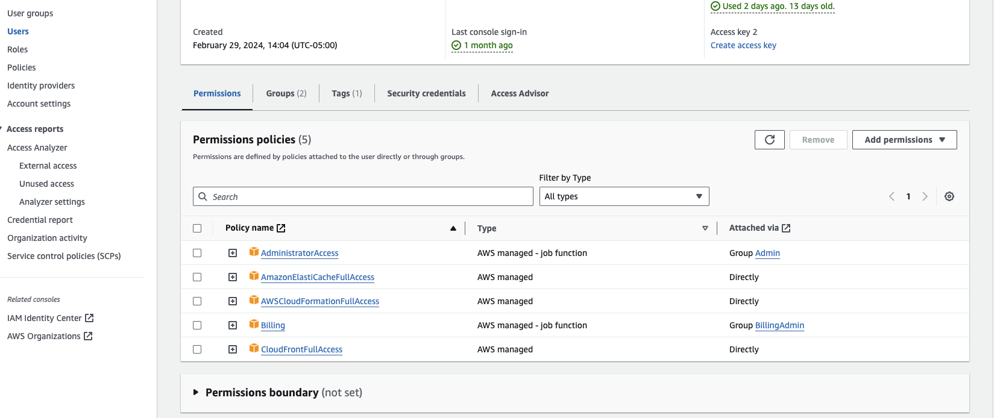
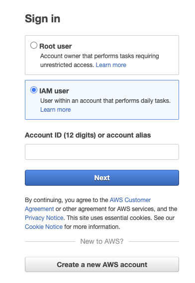

# AWS Deployment Guide for MyFile

## Overview

This guide walks through the process of setting up an AWS account and configuring it to deploy the MyFile application. It covers everything from creating the initial account to configuring an AWS profile that can be used for MyFile deployments.

Select the guide version that best fits your background and expertise level:

- [Expert Version (for Admins/DevOps)](#expert-version-for-adminsdevops)
- [Novice Version (Requires No Prior AWS Knowledge)](#novice-version-requires-no-prior-aws-knowledge)

## Expert Version (for Admins/DevOps)

### Step 1: Create an AWS Account

- Sign up for an AWS account at [aws.amazon.com](https://aws.amazon.com)
- Provide an email address and credit card for billing
- Consider using an AWS Organization for centralized billing and control

### Step 2: Create an IAM User

- Navigate to the IAM (Identity and Access Management) console
- Create a new user and select "Programmatic access"
- Attach appropriate permissions policies: (Administrator Access for full control, AmazonElastiCacheFullAccess, AWSCloudFormationFullAccess, CloudFrontFullAccess)
- Save the generated Access Key ID and Secret Access Key

### Step 3: Configure the AWS CLI

- Install the AWS CLI on your local machine
- Run `aws configure` and enter the IAM user's Access Key ID and Secret Access Key
- Specify a default region and output format

```bash
$ aws configure
AWS Access Key ID [None]: EXAMPLEKEYIDXXXX
AWS Secret Access Key [None]: EXAMPLESECRETKEYXXXXXXXXXXXXX
Default region name [None]: us-west-2
Default output format [None]: json
```

### Step 4: Create a Named Profile for MyFile (Optional)

To use a specific AWS account or IAM user for MyFile deployments, configure a named profile
Run `aws configure --profile MyFileDeployment`
Specify the Access Key ID, Secret Access Key, region and output for the MyFile IAM user

```bash
$ aws configure --profile MyFileDeployment
AWS Access Key ID [None]: [Copy your key ID from the AWS website!]
AWS Secret Access Key [None]: [Copy your key ID from the AWS website!]
Default region name [None]: us-east-1 [or whatever you prefer!]
Default output format [None]: json
```

You now have an AWS account fully configured for programmatic access via the AWS CLI and SDKs. The default or `MyFileDeployment` profile can be used to authenticate deployments of the MyFile application to AWS.

## Novice Version (Requires No Prior AWS Knowledge)

### Introduction

Amazon Web Services (AWS) is a cloud platform offering a wide variety of services for running applications, storing data, and more. To deploy the MyFile application on AWS, you first need to create an AWS account and set up access. Don't worry if you're totally new to AWS - this guide will walk you through each step!

### Step 1: Create an AWS Account

The first thing you need to do to use AWS is sign up for an account:

1. Go to the AWS website at [aws.amazon.com](https://aws.amazon.com)
2. Click the "Create an AWS Account" button
3. Enter an email address, password, and account name. The email and account name must be unique.
4. Provide contact information and a credit card that will be used for billing. You won't be charged unless you use paid services.
5. Verify your identity with a phone call or text message.
6. Select the "Basic" support plan (free) for now.

Congrats, you now have an AWS account! Next you'll set up a user for deploying the MyFile app.

### Step 2: Create an IAM User for MyFile

An IAM (Identity and Access Management) user is like a sub-account within your main AWS account. It has its own credentials and permissions for security.

1. Log in to the AWS Management Console
2. Navigate to the IAM console (search for "IAM" in the services search bar)
3. Click "Users" in the sidebar, then "Add user"
4. Enter a name for the user, like "MyFileDeployer"
5. Under "Select AWS access type", choose "Programmatic access"
6. Click "Next: Permissions". On the next page, click "Attach existing policies directly"
7. Select the following policies that grants the user the necesary permissions for deploying MyFile: Administrator Access for full control, AmazonElastiCacheFullAccess, AWSCloudFormationFullAccess, CloudFrontFullAccess. See the image below for a screenshot of the correct permissions.



8. Then click "Next: Tags" (Optional) Add tags like "App: MyFile" to help identify the user, then click "Next: Review"
9. Review the user details and click "Create user"
10. Copy or save the generated "Access key ID" and "Secret access key" - you'll need these later!

You now have an IAM user that the MyFile application can authenticate as to interact with AWS. Remember to login with your IAM user, not with the root user (in the login screen shown below).



### Step 3: Configure the AWS CLI with MyFile Profile

The AWS CLI (Command Line Interface) lets you interact with AWS from the terminal. Here's how to set it up for MyFile:

1. Install the AWS CLI by following the instructions for your operating system: [aws.amazon.com/cli](https://aws.amazon.com/cli/)
2. Open a terminal or command prompt
3. Run the command `aws configure --profile MyFileDeployment`
4. At the prompts, paste in the "AWS Access Key ID" and "AWS Secret Access Key" you saved earlier when creating the MyFile IAM user
5. For "Default region name", enter the code for the AWS region you want to deploy MyFile to, like `us-east-1`
6. For "Default output format", enter `json`

Your AWS CLI now has a `MyFileDeployment` profile configured with the credentials for the MyFile IAM user.

```bash
$ aws configure --profile MyFileDeployment
AWS Access Key ID [None]: EXAMPLEKEYIDXXXX
AWS Secret Access Key [None]: EXAMPLESECRETKEYXXXXXXXXXXXXX
Default region name [None]: us-east-1
Default output format [None]: json
```

You're all set! With an AWS account and authenticated IAM user for MyFile, you can now deploy the MyFile application to the AWS cloud. The AWS CLI and SDKs can use the `MyFileDeployment` profile you configured to authenticate and interact with AWS services.

To deploy MyFile, you can now run AWS CLI commands with `--profile MyFileDeployment`, or configure your MyFile deployment scripts/tools to use this profile.
If you use the Deployment Script from this repository, remember to offer as profile name `MyFileDeployment` or whatever profile name you have chosen. You can find more information about the Deployment Script in the [Quickstart Guide](quickstart.md).

Happy deploying MyFile on AWS.
